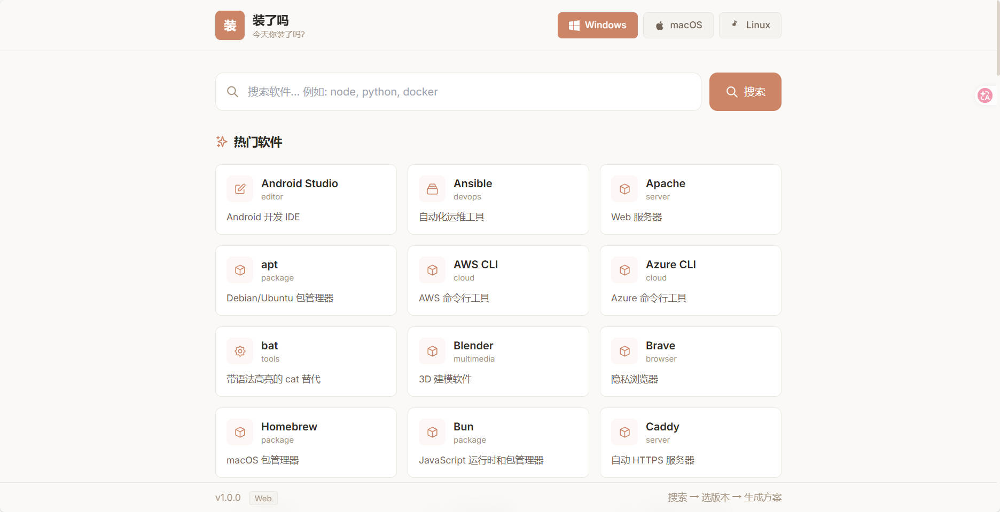
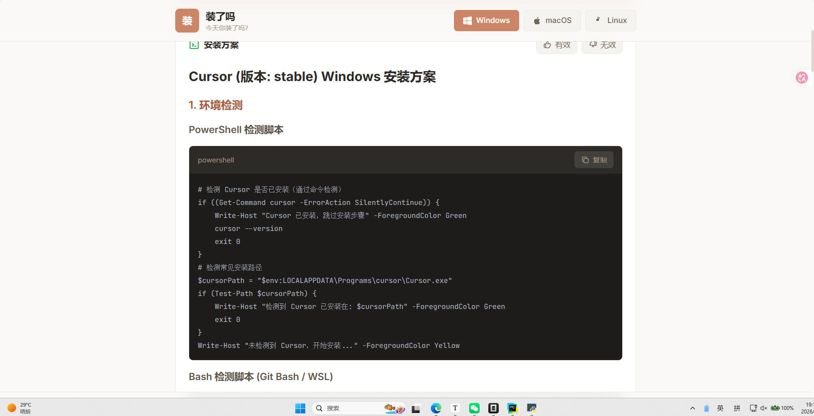
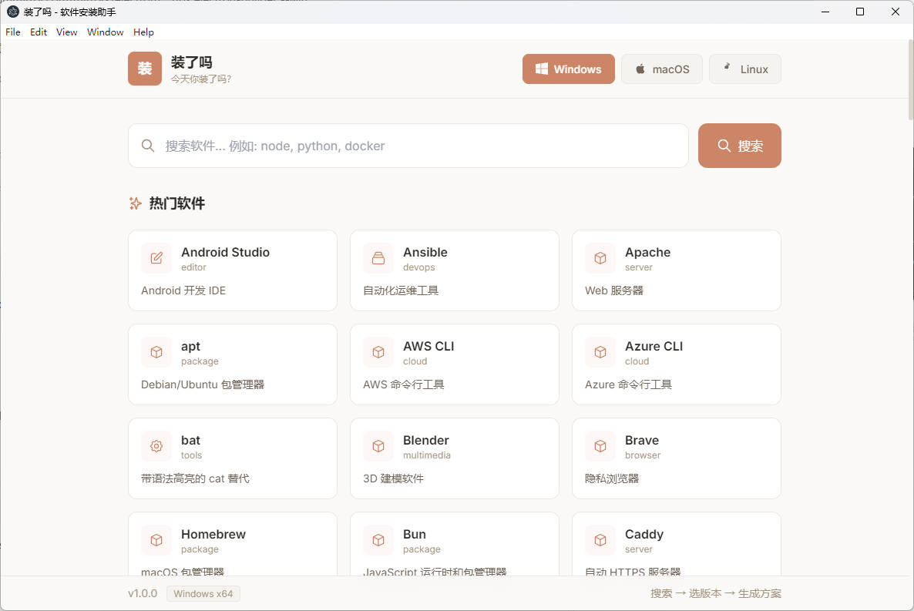
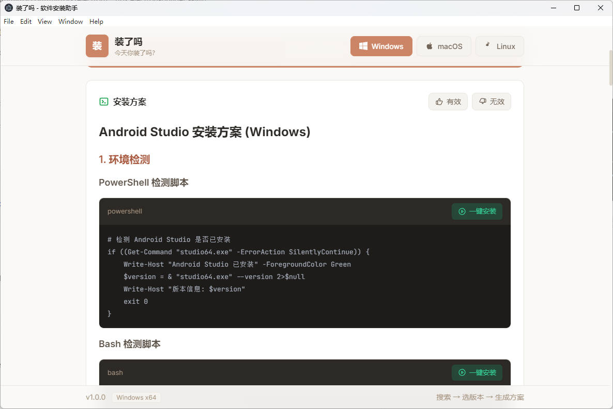

# 装了吗 - 软件安装助手

> 今天你装了吗？

一个帮助开发者快速安装各种开发工具的智能助手。支持 100+ 常用开发软件，AI 自动生成安装方案，一键复制脚本执行。

## 📸 界面预览

### 网页端





### 桌面端





## ✨ 功能特性

### 🖥️ 用户前端 (SPA)
- 🔍 **智能搜索** — 按名称、描述模糊搜索软件
- 📋 **版本选择** — 自动拉取最新版本，支持版本切换
- 🤖 **AI 安装方案** — 自动生成包含环境检测、安装步骤、验证命令的中文方案
- 📥 **一键复制** — 提供 PowerShell / Bash 双版本脚本
- 💬 **用户反馈** — 有效/无效反馈，帮助改进方案质量
- 🎨 **优雅 UI** — Tailwind CSS 响应式设计，支持亮色主题

### 🚀 服务端 (FastAPI + SQLite)
- 📦 **100+ 预置软件** — 覆盖运行时、编辑器、数据库、DevOps、云工具等
- 🔄 **版本自动拉取** — 支持 npm、PyPI、GitHub Releases 等源
- 💾 **方案缓存** — AI 生成的方案入库缓存，二次请求秒出
- 📊 **使用统计** — 热门软件、平台分布、反馈统计
- 🔌 **OpenAI 兼容 API** — 支持任意兼容接口（OpenAI / DeepSeek / 自定义）

### 🖧 管理后台 (React)
- 🔐 **密码登录** — 保护管理功能
- 📝 **方案管理** — 查看/编辑/删除安装方案
- 💬 **反馈管理** — 查看用户反馈
- 📈 **统计面板** — 使用数据可视化

### 💻 桌面应用 (Electron)
- 🖥️ **原生体验** — Electron 桌面壳，内嵌前端页面
- 🚀 **一键启动** — 自动检测服务端状态
- 📋 **脚本执行** — 支持在终端中执行安装脚本
- 🌐 **外部链接** — 安全打开外部下载页面

## 🚀 快速开始

### 前置要求
- Python 3.9+
- Node.js 18+ (桌面应用/管理后台)

### 1. 配置环境变量

```bash
cp .env.example .env
# 编辑 .env 填入你的 AI API Key
```

### 2. 启动服务端

```bash
cd server
pip install -r requirements.txt
python main.py
```

服务端运行在 http://localhost:8000，前端页面在 http://localhost:8000/app

### 3. 启动桌面应用（可选）

```bash
cd desktop
npm install
npm start
```

### 4. 启动管理后台（可选）

```bash
cd admin
npm install
npm start
```

管理后台运行在 http://localhost:3001

### 一键启动

**Linux/macOS:**
```bash
./start.sh
```

**Windows:**
```bat
start.bat
```

## 📁 项目结构

```
sei-InstallLoop/
├── server/                  # FastAPI 服务端
│   ├── main.py              # API 主程序（数据库、路由、AI 集成）
│   └── requirements.txt     # Python 依赖
├── frontend/                # 用户前端 (SPA)
│   └── index.html           # 单文件应用（Tailwind + Marked + Highlight.js）
├── desktop/                 # Electron 桌面应用
│   ├── main.js              # Electron 主进程
│   ├── preload.js           # 预加载脚本（IPC 桥接）
│   ├── public/index.html    # 桌面端入口
│   └── package.json
├── admin/                   # Web 管理后台 (React + TypeScript)
│   ├── src/
│   │   ├── App.tsx          # 主应用（路由、状态管理）
│   │   ├── index.tsx        # 入口
│   │   └── index.css        # Tailwind 样式
│   ├── public/index.html
│   ├── tailwind.config.js
│   └── package.json
├── start.sh                 # 一键启动脚本 (Linux/macOS)
├── start.bat                # 一键启动脚本 (Windows)
├── .env.example             # 环境变量模板
└── README.md
```

## 🔧 配置

### AI API

支持任何 OpenAI 兼容接口。在 `.env` 中配置：

```env
# 使用 DeepSeek（推荐，国内可用）
ANTHROPIC_AUTH_TOKEN=sk-your-deepseek-key
BASE_URL=https://api.deepseek.com
AI_MODEL=deepseek-chat

# 或使用 OpenAI
ANTHROPIC_AUTH_TOKEN=sk-your-openai-key
BASE_URL=https://api.openai.com/v1
AI_MODEL=gpt-4
```

也可读取 `~/.claude/settings.json` 中的配置。

### 管理后台密码

默认密码：`zhuangle2024`，通过环境变量修改：

```bash
export ADMIN_PASSWORD=your-password    # Linux/macOS
set ADMIN_PASSWORD=your-password       # Windows
```

## 📡 API 端点

| 方法 | 路径 | 说明 |
|------|------|------|
| GET | `/api` | API 文档 |
| GET | `/app` | 用户前端页面 |
| GET | `/api/software` | 软件列表 |
| POST | `/api/search` | 搜索软件 |
| GET | `/api/software/{id}/versions` | 获取版本列表 |
| POST | `/api/software/{id}/versions/fetch` | 从源拉取最新版本 |
| POST | `/api/plans/generate` | 生成安装方案 |
| POST | `/api/feedback` | 提交反馈 |
| GET | `/api/stats` | 使用统计 |
| POST | `/api/admin/login` | 管理后台登录 |
| GET | `/api/admin/plans` | 管理方案列表 |
| DELETE | `/api/admin/plans/{id}` | 删除方案 |
| GET | `/api/admin/feedback` | 管理反馈列表 |

## 📦 预置软件（108 个）

| 类别 | 软件 |
|------|------|
| **运行时** (13) | Node.js, Python, Java JDK, Go, Rust, .NET SDK, PHP, Ruby, Swift, Kotlin, Dart, R, Julia |
| **编辑器/IDE** (11) | VS Code, Vim, Neovim, Sublime Text, Notepad++, IntelliJ IDEA, PyCharm, WebStorm, Android Studio, Xcode, Cursor |
| **命令行工具** (12) | Git, cURL, Wget, jq, Tree, htop, bat, fzf, ripgrep, fd, exa, zoxide, Starship |
| **浏览器** (5) | Chrome, Firefox, Edge, Brave, Opera |
| **数据库** (8) | Redis, PostgreSQL, MySQL, MongoDB, SQLite, MariaDB, Elasticsearch, InfluxDB |
| **服务器/中间件** (7) | Nginx, Apache, Caddy, Traefik, RabbitMQ, Kafka, Tomcat |
| **DevOps/容器** (8) | Docker, kubectl, Terraform, Ansible, Vagrant, Puppeteer, Helm, Istioctl |
| **云工具** (7) | AWS CLI, Azure CLI, Google Cloud CLI, Firebase CLI, Vercel CLI, Netlify CLI, Heroku CLI |
| **包管理器** (13) | npm, Yarn, pnpm, Bun, pip, Conda, Poetry, Cargo, Homebrew, Scoop, Chocolatey, winget, apt, yum |
| **构建工具** (9) | CMake, Gradle, Maven, Make, Webpack, Vite, esbuild, Rollup, Turborepo |
| **多媒体** (6) | FFmpeg, ImageMagick, Obsidian, VLC, GIMP, Blender |
| **AI/机器学习** (4) | Ollama, Jupyter, TensorBoard, Weights & Biases |
| **安全** (3) | Nmap, OpenSSL, WireGuard |
| **办公协作** (4) | Notion, Slack, Discord, Zoom |
| **API/数据库工具** (7) | Postman, Insomnia, DBeaver, pgAdmin, Redis Desktop Manager, HTTPie, Mockoon |

> 💡 **添加新软件**：在 `server/main.py` 的 `seed_preset_software()` 函数中添加条目即可。

## 🏗️ 技术栈

| 层级 | 技术 |
|------|------|
| **桌面框架** | Electron 28 |
| **前端** | Vanilla JS + Tailwind CSS + Marked + Highlight.js |
| **管理后台** | React 18 + TypeScript + Tailwind CSS + React Router |
| **服务端** | Python FastAPI + SQLite |
| **AI 集成** | OpenAI 兼容 API（支持 DeepSeek / GPT 等） |
| **图标** | Lucide Icons (管理后台) |

## 🛠️ 支持的安装源类型

| source_type | 说明 | 示例 |
|-------------|------|------|
| `npm` | npm 包，自动拉取最新版本 | Node.js 生态工具 |
| `pypi` | PyPI 包 | Python 生态工具 |
| `github` | GitHub Releases | ripgrep, fzf, bat |
| `official` | 官方网站下载 | Docker, VS Code, Git 等 |
| `rustup` | Rust 工具链 | Rust, Cargo |
| `maven` | Maven Central | Maven |

## 📄 许可证

MIT License
